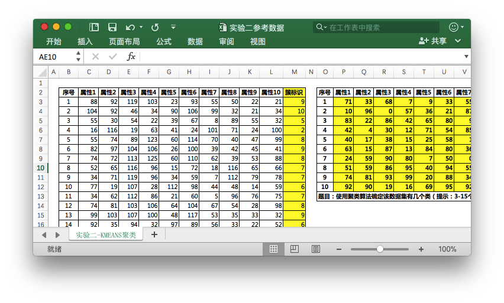
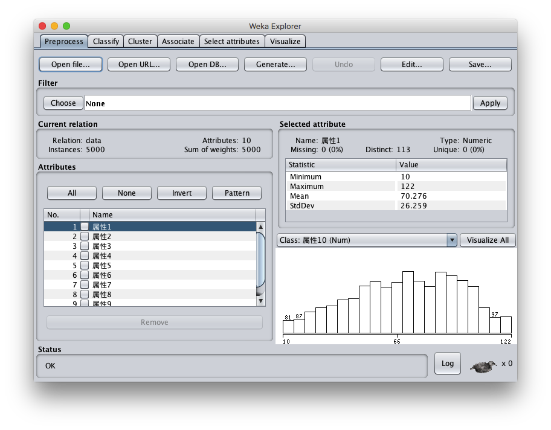

## 实验内容

1.    采用K均值算法对给定数据集合进行聚类，给出聚类结果，并与真实数据分布对比，判断聚类准确度。改变K的数值，研究K值改变与聚类准确度之间的关系。改变初始簇心，研究簇心变化与聚类准确度之间的关系。

2.    请在实验报告中给出你的模型结果，并给出解释。

## 实验过程

### 数据预处理阶段

​	实验所给的数据并不能直接拿来使用，因为里面含有一些诸如最终的簇中心点坐标和簇的个数信息，如下图所示

因此需要对其进行数据预处理，删除了该数据表格中的标黄的右侧表格和簇标识列以及序号列，得到如图所示的数据文件。

另外，如果实验数据不规范还需要对其进行规范化，如其中的实验数据中有某个属性值为空也需要对其进行填补，不过在该实验数据下不需要进行这类的操作。随后将该文件保存为.csv文件，csv文件的内部格式如图所示

可以看到csv格式的文件是用逗号分隔的，最上面的一行为属性的名字，随后接下来的若干行即为实验数据。

​	通过对实验数据的总结得到如图所示的簇标识对应的个数，如图所示

​	可以看到实际上总共的十个簇，每个簇的个数都是500个，因此可以通过这个角度进行衡量，来体现聚类的准确度。

### 聚类实验阶段

通过weka导入数据，如图所示

选择上述的Cluster标签，并选择SimpleKMeans算法进行聚类分析。

由于实验中给定的原始数据已经表明簇的个数为10个，因此可以先从簇为10个的情况开始，通过设定